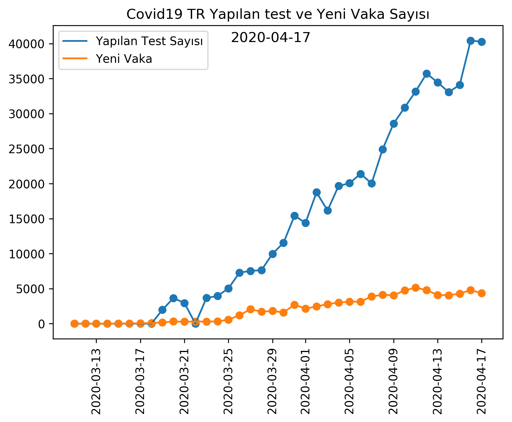
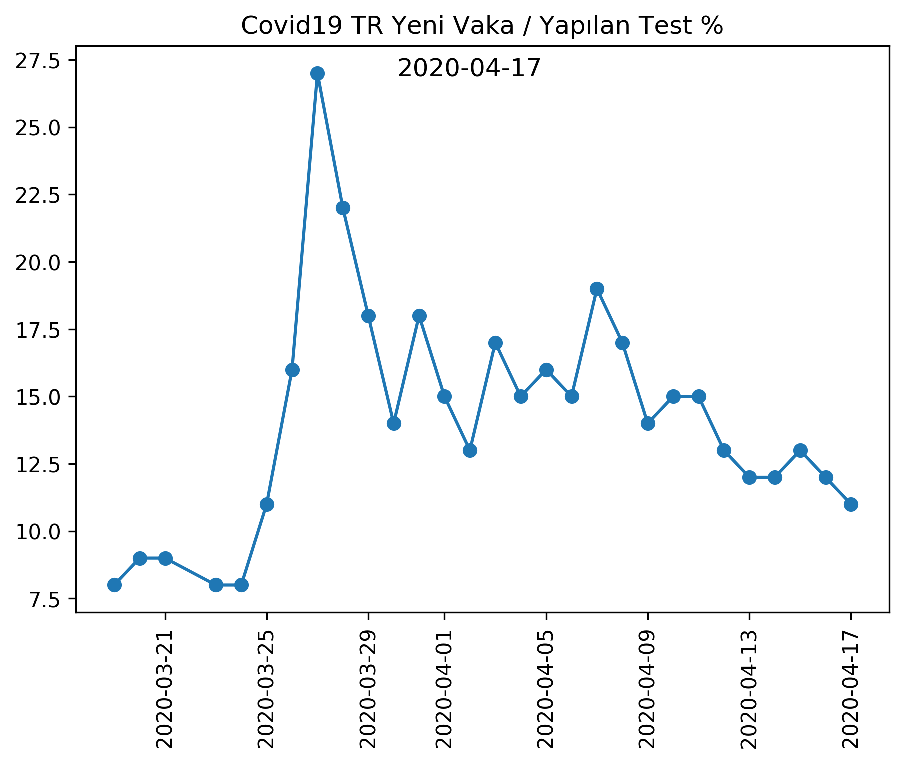

```python
from IPython.display import HTML

HTML('''<script>
code_show=true; 
function code_toggle() {
 if (code_show){
 $('div.input').hide();
 } else {
 $('div.input').show();
 }
 code_show = !code_show
} 
$( document ).ready(code_toggle);
</script>
<form action="javascript:code_toggle()"><input type="submit" value="Click here to toggle on/off the raw code."></form>''')
```


<title>mncam</title>
<script>
code_show=true; 
function code_toggle() {
 if (code_show){
 $('div.input').hide();
 } else {
 $('div.input').show();
 }
 code_show = !code_show
} 
$( document ).ready(code_toggle);
</script>
<form action="javascript:code_toggle()"><input type="submit" value="Click here to toggle on/off the raw code."></form>


```python
import pandas as pd
from matplotlib import pyplot as plt
from datetime import datetime
import math as mt
import plotly.graph_objects as go
from plotly.subplots import make_subplots
import plotly.express as px
```


```python
now = datetime.now()
print ("Son Güncelleme: TSİ", now.strftime("%H:%M:%S %d-%m-%Y"))
```

    Son Güncelleme: TSİ 18:00:21 17-04-2020


# COVID19 TR Grafikler - Cam, M.N.


```python
#Importing .csv file
x = pd.read_csv("./Tr_data.csv", sep=",")

date       = x["Tarih"].values.tolist()
case       = x["Toplam Vaka Sayısı"].values.tolist()
new_cases  = x["Yeni Vaka Sayısı"].values.tolist()
deaths     = x["Ölüm Sayısı"].values.tolist()
made_tests = x["Yapılan Test Sayısı"].values.tolist()

```


```python
#Strings to date and integer

i = 1
while i<=len(date):
    variable = date[i-1]
    date[i-1] = datetime.strptime(variable, '%Y-%m-%d').date()
    i=i+1
    
i = 1
while i<=len(case):
    case[i-1] = int(case[i-1])
    i=i+1
    
i = 1
while i<=len(new_cases):
    new_cases[i-1] = int(new_cases[i-1])
    i=i+1
    
i= 1
while i<=len(deaths):
    deaths[i-1] = int(deaths[i-1])
    i=i+1

i= 1
while i<=len(made_tests):
    made_tests[i-1] = int(made_tests[i-1])
    i=i+1
```

## Vaka Sayısı


```python
name = str(date[-1])
name_cases = "cases" + name +".png"

#vaka sayısı grafik
plt.figure(dpi=300,figsize=(7,5))
plt.plot(date,case)
plt.scatter(date,case)
plt.plot(date,new_cases)
plt.scatter(date,new_cases)
plt.legend(["Toplam","Yeni"])
plt.title("Covid19 TR Vaka Sayıları")
plt.xticks(rotation=90)
plt.figtext(.5,.84,date[-1], fontsize=12, ha='center')
plt.show()

```


## Ölüm Sayıları


```python
name = str(date[-1])
name_deaths = "deaths" + name +".png"

#vaka sayısı grafik
plt.figure(dpi=300,figsize=(7,5))
plt.plot(date,deaths)
plt.scatter(date,deaths)
plt.title("Covid19 TR Ölüm Sayıları")
plt.xticks(rotation=90)
plt.figtext(.5,.84,date[-1], fontsize=12, ha='center')
plt.show()


```


## Yapılan Test & Yeni Vaka Sayısı


```python
name = str(date[-1])
name_case_test = "case_test" + name +".png"

plt.figure(dpi=300,figsize=(7,5))
plt.plot(date,made_tests)
plt.scatter(date,made_tests)
plt.plot(date,new_cases)
plt.scatter(date,new_cases)
plt.legend(["Yapılan Test Sayısı","Yeni Vaka"])
plt.title("Covid19 TR Yapılan test ve Yeni Vaka Sayısı")
plt.xticks(rotation=90)
plt.figtext(.5,.84,date[-1], fontsize=12, ha='center')
plt.show()
```





```python
i = 0
ratio = []

while i<len(new_cases):
    if made_tests[i]==0:
        ratio.append(0)
        i  = i + 1
    else:
        ratio.append(round(new_cases[i]/made_tests[i],2))
        i = i + 1

i = 0
while i<len(ratio):
    ratio[i] = ratio[i]*100
    ratio[i] = int(ratio[i])
    i = i + 1

```

## Yeni Vaka / Yapılan Test (%)


```python
name = str(date[-1])
name_ratio = "ratio" + name +".png"

ratio_without_zeros = []
dates_without_zeros = []

i = 0
for i in range(len(ratio)):
    if ratio[i] != 0:
        ratio_without_zeros.append(ratio[i])
        dates_without_zeros.append(date[i])
        
        

plt.figure(dpi=300,figsize=(7,5))
plt.plot(dates_without_zeros,ratio_without_zeros)
plt.scatter(dates_without_zeros,ratio_without_zeros)
plt.title("Covid19 TR Yeni Vaka / Yapılan Test %")
plt.xticks(rotation=90)
plt.figtext(.5,.84,date[-1], fontsize=12, ha='center')
plt.show()
```





## Birden Fazla Veri Beraber


```python
name = str(date[-1])
name_complex = "complex" + name +".png"

fig = plt.figure(dpi=300, figsize=(7,5))
plt.xticks(rotation=90)
plt.title(name)
ax1 = fig.add_subplot(1, 1, 1)
ax2 = ax1.twinx()
ax1.plot(date,new_cases,color="g")
ax1.plot(date,made_tests)
ax1.legend(["Yeni Vaka", "Yapılan Test"])
ax2.plot(date,ratio, color="orange")
ax2.legend(["Yeni Vaka/Yapılan Test(%)"],loc=1)
ax1.set_ylabel('Sayı')
ax2.set_ylabel('%', color='orange')

plt.show()
```

    /usr/local/lib/python3.7/site-packages/matplotlib/figure.py:98: MatplotlibDeprecationWarning:
    
    
    Adding an axes using the same arguments as a previous axes currently reuses the earlier instance.  In a future version, a new instance will always be created and returned.  Meanwhile, this warning can be suppressed, and the future behavior ensured, by passing a unique label to each axes instance.
    


```python
logaritmic = []

i = 0

while i<len(case):
    logaritmic.append(mt.log10(case[i]))
    i=i+1
```

## Logaritmik Vaka Sayısı


```python
name = str(date[-1])
name_log_case = "log_case" + name +".png"

plt.figure(dpi=300, figsize=(7,5))
plt.plot(date, logaritmic)
plt.title("Logaritmik Vaka")
plt.figtext(.5,.84,date[-1], fontsize=12, ha='center')
plt.xticks(rotation = 90)
plt.show()
```


```python
growth_rate = []

i = 0

while i<len(case):
    growth_rate.append(round(new_cases[i]/case[i-1],2)*100)
    i = i + 1
```

## Vaka Sayısı Artış Oranı (%)


```python
name = str(date[-1])
name_growth_rate = "growth_rate" + name +".png"


plt.figure(dpi=300, figsize=(7,5))
plt.plot(date[10:], growth_rate[10:], color="orange")
plt.xticks(rotation=90)
plt.title("Büyüme Oranı")
plt.figtext(.51,.84,date[-1], fontsize=12, ha='center')
plt.show()

```


```python
i = 5
death_growth = []

while i<len(deaths):
    death_growth.append(round((deaths[i]-deaths[i-1])/deaths[i]*100,2))
    i = i+1 
```

## Ölüm Artış Oranı (%)


```python
name = str(date[-1])
name_death_growth_rate = "death_growth_rate" + name +".png"


plt.figure(dpi=300, figsize=(7,5))
plt.plot(date[12:], death_growth[7:])
plt.title("Ölüm Artış %")
plt.figtext(.51,.84,date[-1], fontsize=12, ha='center')
plt.xticks(rotation=90)
plt.show()


```


## İnteraktif Grafik


```python
fig = make_subplots(specs=[[{"secondary_y": True}]])
fig.add_trace(go.Scatter(x=x["Tarih"], y=x["Toplam Vaka Sayısı"], mode='lines+markers',name='Toplam Vaka'), secondary_y=False)
fig.add_trace(go.Scatter(x=x["Tarih"], y=x["Yeni Vaka Sayısı"], mode="lines+markers", name="Yeni Vaka"), secondary_y=False)
fig.add_trace(go.Scatter(x=x["Tarih"][5:], y=death_growth, mode="lines", name="Ölüm Büyüme Hızı"), secondary_y=True)
fig.add_trace(go.Scatter(x=x["Tarih"][9:], y=growth_rate[10:], mode="lines+markers", name="Vaka Artış Hızı"), secondary_y=True)
fig.show()

```


<div>


            <div id="c9206a78-a153-43c6-b83f-3ab277ad1e40" class="plotly-graph-div" style="height:525px; width:100%;"></div>
            <script type="text/javascript">
                require(["plotly"], function(Plotly) {
                    window.PLOTLYENV=window.PLOTLYENV || {};

                if (document.getElementById("c9206a78-a153-43c6-b83f-3ab277ad1e40")) {
                    Plotly.newPlot(
                        'c9206a78-a153-43c6-b83f-3ab277ad1e40',
                        [{"mode": "lines+markers", "name": "Toplam Vaka", "type": "scatter", "x": ["2020-03-11", "2020-03-12", "2020-03-13", "2020-03-14", "2020-03-15", "2020-03-16", "2020-03-17", "2020-03-18", "2020-03-19", "2020-03-20", "2020-03-21", "2020-03-22", "2020-03-23", "2020-03-24", "2020-03-25", "2020-03-26", "2020-03-27", "2020-03-28", "2020-03-29", "2020-03-30", "2020-03-31", "2020-04-01", "2020-04-02", "2020-04-03", "2020-04-04", "2020-04-05", "2020-04-06", "2020-04-07", "2020-04-08", "2020-04-09", "2020-04-10", "2020-04-11", "2020-04-12", "2020-04-13", "2020-04-14", "2020-04-15", "2020-04-16", "2020-04-17"], "xaxis": "x", "y": [1, 1, 5, 6, 18, 47, 98, 191, 359, 670, 947, 1256, 1549, 1872, 2433, 3629, 5698, 7402, 9217, 10827, 13531, 15679, 18135, 20921, 23934, 27069, 30217, 34109, 38226, 42282, 47029, 52167, 56956, 61049, 65111, 69392, 74193, 78546], "yaxis": "y"}, {"mode": "lines+markers", "name": "Yeni Vaka", "type": "scatter", "x": ["2020-03-11", "2020-03-12", "2020-03-13", "2020-03-14", "2020-03-15", "2020-03-16", "2020-03-17", "2020-03-18", "2020-03-19", "2020-03-20", "2020-03-21", "2020-03-22", "2020-03-23", "2020-03-24", "2020-03-25", "2020-03-26", "2020-03-27", "2020-03-28", "2020-03-29", "2020-03-30", "2020-03-31", "2020-04-01", "2020-04-02", "2020-04-03", "2020-04-04", "2020-04-05", "2020-04-06", "2020-04-07", "2020-04-08", "2020-04-09", "2020-04-10", "2020-04-11", "2020-04-12", "2020-04-13", "2020-04-14", "2020-04-15", "2020-04-16", "2020-04-17"], "xaxis": "x", "y": [1, 0, 4, 1, 12, 29, 51, 93, 168, 311, 277, 309, 293, 323, 561, 1196, 2069, 1704, 1815, 1610, 2704, 2148, 2456, 2786, 3013, 3135, 3148, 3892, 4117, 4056, 4747, 5138, 4789, 4093, 4062, 4281, 4801, 4353], "yaxis": "y"}, {"mode": "lines", "name": "\u00d6l\u00fcm B\u00fcy\u00fcme H\u0131z\u0131", "type": "scatter", "x": ["2020-03-16", "2020-03-17", "2020-03-18", "2020-03-19", "2020-03-20", "2020-03-21", "2020-03-22", "2020-03-23", "2020-03-24", "2020-03-25", "2020-03-26", "2020-03-27", "2020-03-28", "2020-03-29", "2020-03-30", "2020-03-31", "2020-04-01", "2020-04-02", "2020-04-03", "2020-04-04", "2020-04-05", "2020-04-06", "2020-04-07", "2020-04-08", "2020-04-09", "2020-04-10", "2020-04-11", "2020-04-12", "2020-04-13", "2020-04-14", "2020-04-15", "2020-04-16", "2020-04-17"], "xaxis": "x", "y": [100.0, 0.0, 50.0, 50.0, 55.56, 57.14, 30.0, 18.92, 15.91, 25.42, 21.33, 18.48, 14.81, 17.56, 22.02, 21.5, 22.74, 22.19, 16.24, 15.17, 12.72, 11.56, 10.48, 10.71, 10.57, 9.74, 8.63, 8.1, 7.56, 7.63, 7.58, 7.61, 7.12], "yaxis": "y2"}, {"mode": "lines+markers", "name": "Vaka Art\u0131\u015f H\u0131z\u0131", "type": "scatter", "x": ["2020-03-20", "2020-03-21", "2020-03-22", "2020-03-23", "2020-03-24", "2020-03-25", "2020-03-26", "2020-03-27", "2020-03-28", "2020-03-29", "2020-03-30", "2020-03-31", "2020-04-01", "2020-04-02", "2020-04-03", "2020-04-04", "2020-04-05", "2020-04-06", "2020-04-07", "2020-04-08", "2020-04-09", "2020-04-10", "2020-04-11", "2020-04-12", "2020-04-13", "2020-04-14", "2020-04-15", "2020-04-16", "2020-04-17"], "xaxis": "x", "y": [41.0, 33.0, 23.0, 21.0, 30.0, 49.0, 56.99999999999999, 30.0, 25.0, 17.0, 25.0, 16.0, 16.0, 15.0, 14.000000000000002, 13.0, 12.0, 13.0, 12.0, 11.0, 11.0, 11.0, 9.0, 7.000000000000001, 7.000000000000001, 7.000000000000001, 7.000000000000001, 6.0], "yaxis": "y2"}],
                        {"template": {"data": {"bar": [{"error_x": {"color": "#2a3f5f"}, "error_y": {"color": "#2a3f5f"}, "marker": {"line": {"color": "#E5ECF6", "width": 0.5}}, "type": "bar"}], "barpolar": [{"marker": {"line": {"color": "#E5ECF6", "width": 0.5}}, "type": "barpolar"}], "carpet": [{"aaxis": {"endlinecolor": "#2a3f5f", "gridcolor": "white", "linecolor": "white", "minorgridcolor": "white", "startlinecolor": "#2a3f5f"}, "baxis": {"endlinecolor": "#2a3f5f", "gridcolor": "white", "linecolor": "white", "minorgridcolor": "white", "startlinecolor": "#2a3f5f"}, "type": "carpet"}], "choropleth": [{"colorbar": {"outlinewidth": 0, "ticks": ""}, "type": "choropleth"}], "contour": [{"colorbar": {"outlinewidth": 0, "ticks": ""}, "colorscale": [[0.0, "#0d0887"], [0.1111111111111111, "#46039f"], [0.2222222222222222, "#7201a8"], [0.3333333333333333, "#9c179e"], [0.4444444444444444, "#bd3786"], [0.5555555555555556, "#d8576b"], [0.6666666666666666, "#ed7953"], [0.7777777777777778, "#fb9f3a"], [0.8888888888888888, "#fdca26"], [1.0, "#f0f921"]], "type": "contour"}], "contourcarpet": [{"colorbar": {"outlinewidth": 0, "ticks": ""}, "type": "contourcarpet"}], "heatmap": [{"colorbar": {"outlinewidth": 0, "ticks": ""}, "colorscale": [[0.0, "#0d0887"], [0.1111111111111111, "#46039f"], [0.2222222222222222, "#7201a8"], [0.3333333333333333, "#9c179e"], [0.4444444444444444, "#bd3786"], [0.5555555555555556, "#d8576b"], [0.6666666666666666, "#ed7953"], [0.7777777777777778, "#fb9f3a"], [0.8888888888888888, "#fdca26"], [1.0, "#f0f921"]], "type": "heatmap"}], "heatmapgl": [{"colorbar": {"outlinewidth": 0, "ticks": ""}, "colorscale": [[0.0, "#0d0887"], [0.1111111111111111, "#46039f"], [0.2222222222222222, "#7201a8"], [0.3333333333333333, "#9c179e"], [0.4444444444444444, "#bd3786"], [0.5555555555555556, "#d8576b"], [0.6666666666666666, "#ed7953"], [0.7777777777777778, "#fb9f3a"], [0.8888888888888888, "#fdca26"], [1.0, "#f0f921"]], "type": "heatmapgl"}], "histogram": [{"marker": {"colorbar": {"outlinewidth": 0, "ticks": ""}}, "type": "histogram"}], "histogram2d": [{"colorbar": {"outlinewidth": 0, "ticks": ""}, "colorscale": [[0.0, "#0d0887"], [0.1111111111111111, "#46039f"], [0.2222222222222222, "#7201a8"], [0.3333333333333333, "#9c179e"], [0.4444444444444444, "#bd3786"], [0.5555555555555556, "#d8576b"], [0.6666666666666666, "#ed7953"], [0.7777777777777778, "#fb9f3a"], [0.8888888888888888, "#fdca26"], [1.0, "#f0f921"]], "type": "histogram2d"}], "histogram2dcontour": [{"colorbar": {"outlinewidth": 0, "ticks": ""}, "colorscale": [[0.0, "#0d0887"], [0.1111111111111111, "#46039f"], [0.2222222222222222, "#7201a8"], [0.3333333333333333, "#9c179e"], [0.4444444444444444, "#bd3786"], [0.5555555555555556, "#d8576b"], [0.6666666666666666, "#ed7953"], [0.7777777777777778, "#fb9f3a"], [0.8888888888888888, "#fdca26"], [1.0, "#f0f921"]], "type": "histogram2dcontour"}], "mesh3d": [{"colorbar": {"outlinewidth": 0, "ticks": ""}, "type": "mesh3d"}], "parcoords": [{"line": {"colorbar": {"outlinewidth": 0, "ticks": ""}}, "type": "parcoords"}], "pie": [{"automargin": true, "type": "pie"}], "scatter": [{"marker": {"colorbar": {"outlinewidth": 0, "ticks": ""}}, "type": "scatter"}], "scatter3d": [{"line": {"colorbar": {"outlinewidth": 0, "ticks": ""}}, "marker": {"colorbar": {"outlinewidth": 0, "ticks": ""}}, "type": "scatter3d"}], "scattercarpet": [{"marker": {"colorbar": {"outlinewidth": 0, "ticks": ""}}, "type": "scattercarpet"}], "scattergeo": [{"marker": {"colorbar": {"outlinewidth": 0, "ticks": ""}}, "type": "scattergeo"}], "scattergl": [{"marker": {"colorbar": {"outlinewidth": 0, "ticks": ""}}, "type": "scattergl"}], "scattermapbox": [{"marker": {"colorbar": {"outlinewidth": 0, "ticks": ""}}, "type": "scattermapbox"}], "scatterpolar": [{"marker": {"colorbar": {"outlinewidth": 0, "ticks": ""}}, "type": "scatterpolar"}], "scatterpolargl": [{"marker": {"colorbar": {"outlinewidth": 0, "ticks": ""}}, "type": "scatterpolargl"}], "scatterternary": [{"marker": {"colorbar": {"outlinewidth": 0, "ticks": ""}}, "type": "scatterternary"}], "surface": [{"colorbar": {"outlinewidth": 0, "ticks": ""}, "colorscale": [[0.0, "#0d0887"], [0.1111111111111111, "#46039f"], [0.2222222222222222, "#7201a8"], [0.3333333333333333, "#9c179e"], [0.4444444444444444, "#bd3786"], [0.5555555555555556, "#d8576b"], [0.6666666666666666, "#ed7953"], [0.7777777777777778, "#fb9f3a"], [0.8888888888888888, "#fdca26"], [1.0, "#f0f921"]], "type": "surface"}], "table": [{"cells": {"fill": {"color": "#EBF0F8"}, "line": {"color": "white"}}, "header": {"fill": {"color": "#C8D4E3"}, "line": {"color": "white"}}, "type": "table"}]}, "layout": {"annotationdefaults": {"arrowcolor": "#2a3f5f", "arrowhead": 0, "arrowwidth": 1}, "coloraxis": {"colorbar": {"outlinewidth": 0, "ticks": ""}}, "colorscale": {"diverging": [[0, "#8e0152"], [0.1, "#c51b7d"], [0.2, "#de77ae"], [0.3, "#f1b6da"], [0.4, "#fde0ef"], [0.5, "#f7f7f7"], [0.6, "#e6f5d0"], [0.7, "#b8e186"], [0.8, "#7fbc41"], [0.9, "#4d9221"], [1, "#276419"]], "sequential": [[0.0, "#0d0887"], [0.1111111111111111, "#46039f"], [0.2222222222222222, "#7201a8"], [0.3333333333333333, "#9c179e"], [0.4444444444444444, "#bd3786"], [0.5555555555555556, "#d8576b"], [0.6666666666666666, "#ed7953"], [0.7777777777777778, "#fb9f3a"], [0.8888888888888888, "#fdca26"], [1.0, "#f0f921"]], "sequentialminus": [[0.0, "#0d0887"], [0.1111111111111111, "#46039f"], [0.2222222222222222, "#7201a8"], [0.3333333333333333, "#9c179e"], [0.4444444444444444, "#bd3786"], [0.5555555555555556, "#d8576b"], [0.6666666666666666, "#ed7953"], [0.7777777777777778, "#fb9f3a"], [0.8888888888888888, "#fdca26"], [1.0, "#f0f921"]]}, "colorway": ["#636efa", "#EF553B", "#00cc96", "#ab63fa", "#FFA15A", "#19d3f3", "#FF6692", "#B6E880", "#FF97FF", "#FECB52"], "font": {"color": "#2a3f5f"}, "geo": {"bgcolor": "white", "lakecolor": "white", "landcolor": "#E5ECF6", "showlakes": true, "showland": true, "subunitcolor": "white"}, "hoverlabel": {"align": "left"}, "hovermode": "closest", "mapbox": {"style": "light"}, "paper_bgcolor": "white", "plot_bgcolor": "#E5ECF6", "polar": {"angularaxis": {"gridcolor": "white", "linecolor": "white", "ticks": ""}, "bgcolor": "#E5ECF6", "radialaxis": {"gridcolor": "white", "linecolor": "white", "ticks": ""}}, "scene": {"xaxis": {"backgroundcolor": "#E5ECF6", "gridcolor": "white", "gridwidth": 2, "linecolor": "white", "showbackground": true, "ticks": "", "zerolinecolor": "white"}, "yaxis": {"backgroundcolor": "#E5ECF6", "gridcolor": "white", "gridwidth": 2, "linecolor": "white", "showbackground": true, "ticks": "", "zerolinecolor": "white"}, "zaxis": {"backgroundcolor": "#E5ECF6", "gridcolor": "white", "gridwidth": 2, "linecolor": "white", "showbackground": true, "ticks": "", "zerolinecolor": "white"}}, "shapedefaults": {"line": {"color": "#2a3f5f"}}, "ternary": {"aaxis": {"gridcolor": "white", "linecolor": "white", "ticks": ""}, "baxis": {"gridcolor": "white", "linecolor": "white", "ticks": ""}, "bgcolor": "#E5ECF6", "caxis": {"gridcolor": "white", "linecolor": "white", "ticks": ""}}, "title": {"x": 0.05}, "xaxis": {"automargin": true, "gridcolor": "white", "linecolor": "white", "ticks": "", "title": {"standoff": 15}, "zerolinecolor": "white", "zerolinewidth": 2}, "yaxis": {"automargin": true, "gridcolor": "white", "linecolor": "white", "ticks": "", "title": {"standoff": 15}, "zerolinecolor": "white", "zerolinewidth": 2}}}, "xaxis": {"anchor": "y", "domain": [0.0, 0.94]}, "yaxis": {"anchor": "x", "domain": [0.0, 1.0]}, "yaxis2": {"anchor": "x", "overlaying": "y", "side": "right"}},
                        {"responsive": true}
                    ).then(function(){

var gd = document.getElementById('c9206a78-a153-43c6-b83f-3ab277ad1e40');
var x = new MutationObserver(function (mutations, observer) {{
        var display = window.getComputedStyle(gd).display;
        if (!display || display === 'none') {{
            console.log([gd, 'removed!']);
            Plotly.purge(gd);
            observer.disconnect();
        }}
}});

// Listen for the removal of the full notebook cells
var notebookContainer = gd.closest('#notebook-container');
if (notebookContainer) {{
    x.observe(notebookContainer, {childList: true});
}}

// Listen for the clearing of the current output cell
var outputEl = gd.closest('.output');
if (outputEl) {{
    x.observe(outputEl, {childList: true});
}}

                        })
                };
                });
            </script>
        </div>


<b>Mehmet Numan Çam</b> <br>
İletişim: <a href="mailto:mncam051@gmail.com">mncam051@gmail.com</a>
